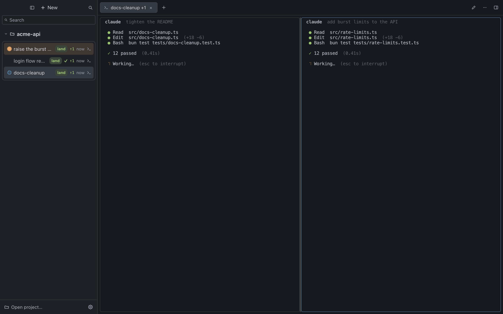
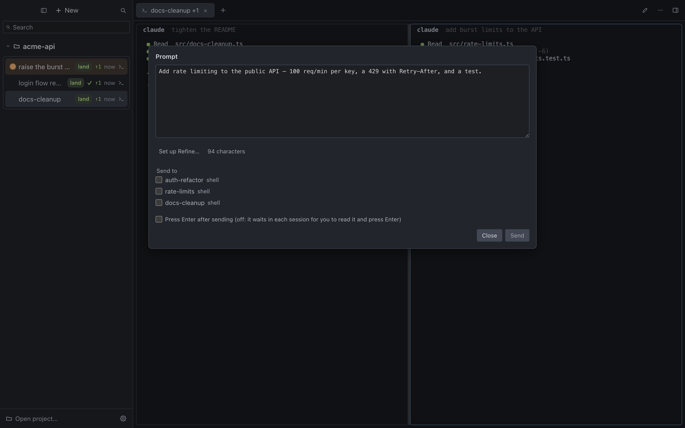
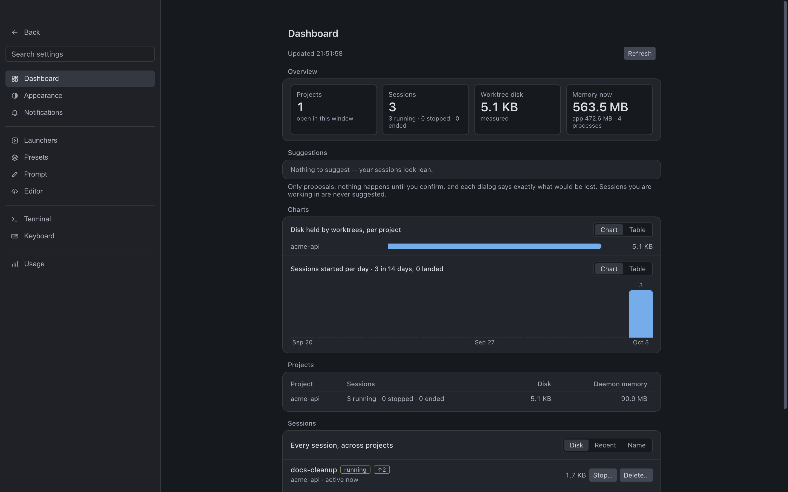

# crossweave

Your agents run as parallel warp threads. **crossweave is the weft** — the
cross-thread that binds them so the fabric holds together.

[](LICENSE)
[](https://github.com/NMHx2005/crossweave/releases)
[](https://github.com/NMHx2005/crossweave/actions/workflows/ci.yml)
[](https://bun.sh)
[](#requirements)

crossweave is a local-first cockpit for running many sessions on one repository
and landing them back. A **session is a git worktree plus a shell in it** — like a
tmux window, but each one on its own branch. What runs in that shell is yours to
type: `claude …`, your own `cx` wrapper, `codex …`, a dev server. crossweave does
not pick, configure or launch agents. A background daemon:

- **isolates runtime, not just files** — each session gets its own port block
  (`$PORT`), cache dir and optional DB/Docker names, not just its own checkout;
- **closes the loop** — it trial-merges sessions against each other in the
  background, so `cw land` tells you what is safe to merge and in what order;
- **shows what landing would bring in** — a per-session diff against where it left
  the base, before you land it.

<p align="center"></p>
<p align="center"><sub>Screenshot of a made-up project (<code>acme-api</code>) on a scratch HOME — generated by <code>apps/cockpit/scripts/demo-shot.ts</code>, no real data.</sub></p>

The desktop **Cockpit** puts every session on one rail that says what each is doing
(working, waiting for you, done, failed), and closes the loop around the agents you run:
write one prompt and send it to several sessions, see which answered and what they said,
see *why* a run failed in one place, and land the one that holds up.

**Who it is for:** you already run several coding agents (or dev servers) side by side on one
repository and are tired of hand-merging at the end of the day. **Who it is not for:** anyone
who wants crossweave to choose, configure or supervise the agent — it never does — or who needs
Windows (not a target).

What was removed on purpose, and the last tag that still had it: the collision guard
(Collision Radar, tiers/Safe Mode, agent adapters, the OS sandbox) — `v0.3-radar`; the
browser remote control (`cw gateway`) — `v0.4-remote-web`; in-app voice input (dictation
is left to a system-wide tool such as Handy or Superwhisper) — `v0.5-voice-input`.

## Status

Workspace/session management, worktree isolation, per-session leases, the
Convergence Engine, land / land all, notifications, distribution/self-update, the
TUI and the desktop cockpit are built and tested. Since 0.4.0 a running session can
tell the cockpit it is done (`cw notify`), a session's work can be tested before
landing (`cw check`), a shell can arrange the cockpit's panes (`cw pane`) and an agent
can read and drive a Browser pane (`cw browser`); the cockpit adds a prompt composer,
side-by-side session comparison, one-click session presets and a session history.
On `main`, after 0.5.0, comes the **AI debug loop**: `cw hooks install` wires an agent's
own hooks to `cw notify` so done/asked marks are exact, `cw debug` prints one compact,
secret-scrubbed bundle of why a session failed (made to paste into an AI), and the cockpit
gains a Debug pane, a Responses view for a prompt sent to several sessions, and
`cw browser errors`. These are unreleased; their running-app (CDP) check is still pending.
[`docs/PROGRESS.md`](docs/PROGRESS.md) says what is done, what was removed and what is next.

> [!NOTE]
> Interactive TTY testing of the TUI (`cw tui`) has been reviewed but not
> yet manually exercised end-to-end by a human. Known gaps are tracked in
> `docs/superpowers/specs/2026-08-14-known-limitations-digest.md` (the
> short version — start here) and per-milestone in
> `docs/superpowers/specs/*-known-limitations.md` — worth a skim before you
> lean on crossweave for anything you'd be upset to lose.

## Requirements

| | |
|---|---|
| Runtime | [Bun](https://bun.sh) 1.3.13+ (earlier 1.3.x has a unix-socket bug that lets a second daemon steal a live one's socket; 1.3.12 itself truncates the code signature on `bun build --compile` macOS output, which gets the binary SIGKILLed on launch) |
| OS | macOS or Linux (Bun's pty support is POSIX-only; Windows is not a V1 target) |
| VCS | git |

## Install

```bash
curl -fsSL https://raw.githubusercontent.com/NMHx2005/crossweave/main/install.sh | sh
```

Installs `cw`/`cwd` to `~/.local/bin` for macOS (arm64/x64) and Linux
(x64). On macOS arm64, releases that carry the Cockpit asset also install it to
`~/Applications/crossweave Cockpit.app` (the installer remains compatible with
older releases that do not carry the app). Every downloaded artifact is
checksum-verified; the installer uses no `sudo` and never edits shell rc files.

`cw` checks for a newer version in the background (cached, at most once a
day) and tells you to run `cw update` when one exists — never installs
anything without you running that command. Turn it off with `cw config
update-check off`.

### From source (for crossweave's own development)

```bash
git clone https://github.com/NMHx2005/crossweave crossweave
cd crossweave
bun install
bun run scripts/build.ts   # produces dist/cw and dist/cwd
```

## Quickstart

```bash
cd your-project        # any git repo
cw init                # create/attach this repo's crossweave workspace
cw                     # opens the cockpit (macOS) or the TUI

cw session new api      # independent worktree on branch cw/api
cw session new web      # independent worktree on branch cw/web
# Terminal 1: open the first shell (Ctrl-] detaches)
cw session attach api
# …in each shell, run your own tools and make/commit changes in that worktree
# In a second terminal:
cw session attach web

cw session stop api    # close the shell (and what runs in it); the worktree stays
cw session start api   # open a fresh shell there
```

Check what's safe to merge, then land conflict-free work:

```bash
cw converge status      # pairwise conflict matrix + recommended merge order
cw land all             # land every conflict-free, committed session, in that order
```

Each session has its own branch and worktree. Commit the changes you want to keep
inside that session before landing it; `cw converge status` shows conflicts and a
recommended order, and `cw land` still performs its own trial merge. If this project
has a trusted `converge.testCommand`, run `cw config trust` once and then `cw check`
before landing to see the test verdict on the session row.

Other everyday commands:

| Command | What it does |
|---|---|
| `cw tui` | Live dashboard — sessions, convergence, activity |
| `cw session list` | Sessions, their branch and their leases |
| `cw session path <name>` | A session's worktree (`cd $(cw session path alice)`) |
| `cw gc` | Reclaim worktrees/branches from ended sessions |
| `cw config notify off` | Mute desktop notifications (or `--event land\|convergence`) |
| `cw config trust` | Trust `converge.testCommand` for this workspace |
| `cw notify "tests written" [--kind done\|ask]` | Say, from inside a session (or its agent's hook), that it is done or needs an answer: ✓ or amber on its row, the words in the notification |
| `cw check [session]` | Run the trusted `converge.testCommand` in a session's worktree; exits 1 on failure; the rail shows `✓ tests` / `✗ tests` |
| `cw hooks install\|remove <claude\|codex> [--yes]` | Wire (or take back) the agent's own `Stop`/`Notification` hooks to `cw notify`, so marks are exact. Merges into the agent's config, backs it up first, never overwrites a file it cannot parse; Gemini has no hook system to wire |
| `cw debug [session] [--raw]` | One compact text bundle for a session — the last check's failing tail, the error lines its terminal showed, the diffstat, the agent's latest words — with secrets scrubbed by a heuristic (`--raw` turns that off). Made to paste to an AI |
| `cw session history` | Sessions that were landed or deleted, kept after their row is gone |
| `cw pane list\|split\|select\|zoom\|layout\|move\|sync\|close\|open` | Arrange the running cockpit's panes from a shell (it asks you before it closes, synchronizes or opens a page or file) |
| `cw browser list\|console\|network\|errors\|dom\|shot\|navigate\|click\|type\|eval` | Let an agent read and drive a Browser pane — only when the pane's **Agent** switch is on (off by default); text read from a page is untrusted data |

Full command tree: `cw --help`, and `cw <command> --help` for any
subcommand.

## Cockpit (desktop)

For daily use, **crossweave Cockpit** is an Electron thin client over
`cwd`, laid out like SpaceVibe Deck: one sidebar lists every open project and its
sessions, each row saying what is happening (working, waiting for you, failed, closed),
what the agent last said, how long ago and which agent runs — all inferred from the
session's shell, nothing to configure. It opens on its own (Dock, Spotlight) with a
welcome, or on a project with `cw`. A row's mark is quiet on purpose: nothing for a shell
with nothing running, a turning ring while an agent works, a ✓ when one finished and you
have not looked yet, amber when it asks you something. ⌘T asks which project, and whether to start a plain
Terminal or one of your **launchers** — Claude Code, Codex, Gemini CLI, OpenCode, Cursor
Agent, Copilot CLI, Aider, Amp, Qwen Code, or your own (`cx`); the ones not installed are
greyed out, and each launcher's command and environment are edited in Settings (⌘,). The
shell opens in the project folder — or in a worktree of its own, per session or as a
project's default — and the launcher's line is typed into it; ⌘D / ⌘⇧D split, ⌘W closes
a pane, ⌘1…⌘9 jump down the rail; tabs hold shells, files, web pages and the Changes
pane (the diff landing would bring in); a ready session carries a Land chip, and every
row shows its uncommitted files and commits to land. Right-click a project to rename it
(in the app only), color, reorder or close it, open it in Finder or your editor, start a
terminal in its folder, land everything ready, clean up ended sessions, or set its
defaults; right-click a session for the same folder actions and rename (or double-click
it). A filter box narrows the rail; the Dock counts sessions waiting for you.
Also in the cockpit: a **prompt composer** (⌘⇧P) to write one prompt, optionally refine
it with a program you name (Settings → Prompt) and send it to one or several sessions;
**Compare with another…** (session menu) to put two sessions' changes side by side and land
the better one; **presets** (Settings → Presets, then ⌘T) that start a session, its dev
terminals and a browser on its port in one click; **Run checks** and a session **history**
(⌘⇧H); a per-session **Debug** pane (session menu → Debug: the failing tail, the error lines,
the browser panes' console errors and failed requests, the diff — with "Send to session", which
only drafts the text into the composer for you to confirm) and a **Responses** view (⌘⇧R) listing
the sessions your last prompt reached, each with its state, its agent's last words and its check;
a Cursor-style **Settings** page with a **Dashboard** (projects, sessions, the disk their
worktrees hold, memory, and proposals to stop or delete what is idle — nothing happens until you confirm); tmux-style panes (`Ctrl-A` then a key, synchronize, copy-mode, optional terminal
persistence); and a per-pane **Agent** switch (Off / Read / Control) for `cw browser`.
Same daemon and evidence gate as the CLI; the app never spawns anything itself.

<p align="center"> </p>
On macOS arm64 the standard installer includes it when the selected release
carries the app asset, and bare `cw` opens it
for the current repository. If the app is absent or cannot launch, `cw`
falls back to the TUI; `cw tui` always selects the terminal dashboard.

| | |
|---|---|
| v1 platform | macOS arm64 only (`macOS-only-v1`) |
| Windows / Linux cockpit | Deferred until `cwd` is portable on those OSes |
| Design | `docs/superpowers/specs/2026-09-17-cockpit-design-system.md` — one token layer (`apps/cockpit/src/ui/tokens.ts`) shared by the chrome and the panes |
| Dev | `cd apps/cockpit && bun install && bun run dev` |
| Package | `cd apps/cockpit && bun run dist:mac` — see `apps/cockpit/README.md` |
| Design | `docs/superpowers/specs/2026-09-16-cockpit-electron-design.md` |

## Configuration

Per-repo settings live in `crossweave.config.json` at the repo root — ports, disk
limits, the DB lease strategy, and `converge.testCommand` (must be explicitly
trusted via `cw config trust` before crossweave will run it — it's arbitrary shell).
Per-user settings live in `~/.crossweave/settings.json`: the editor Cmd+click opens, launchers,
saved layouts, appearance, keyboard shortcuts, terminal persistence (`persistence.terminals`,
off by default), the composer's refine command (`prompt.refine`) and session `presets`. Presets
and the refine command run programs *you* wrote there; nothing a repository contains can add one.

## Contributing / development

```bash
bun test --max-concurrency=1   # full suite (includes the cockpit's tests)
bun run typecheck              # tsc --noEmit
bun run build                  # dist/cw, dist/cwd
cd apps/cockpit && bun test && bun run build
```

Pty and unix-socket tests need to run outside a restricted sandbox. Each cockpit feature also has a
script under `apps/cockpit/scripts/` that drives the *running app* over CDP on a scratch `HOME`
(see `apps/cockpit/README.md`). Release notes live in `docs/releases/`.

See [`CONTRIBUTING.md`](CONTRIBUTING.md) for the ground rules and the gate, `AGENTS.md` for the map of the code and the decisions
already made, and `docs/superpowers/plans/` and `docs/superpowers/specs/` for how each milestone was designed and implemented.
Security problems: [`SECURITY.md`](SECURITY.md) (please do not open a public issue).

## License

[MIT](LICENSE)
